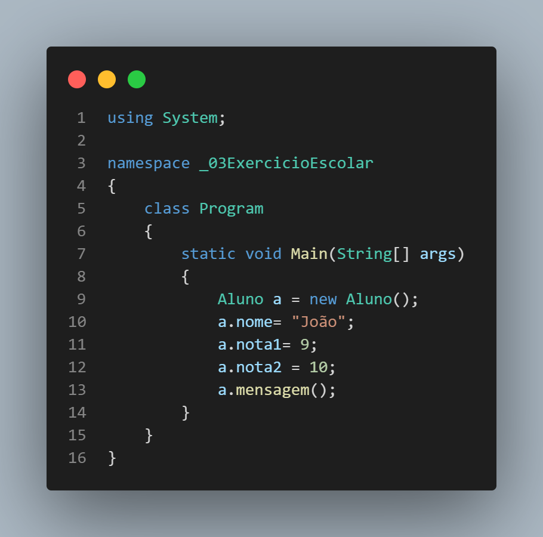
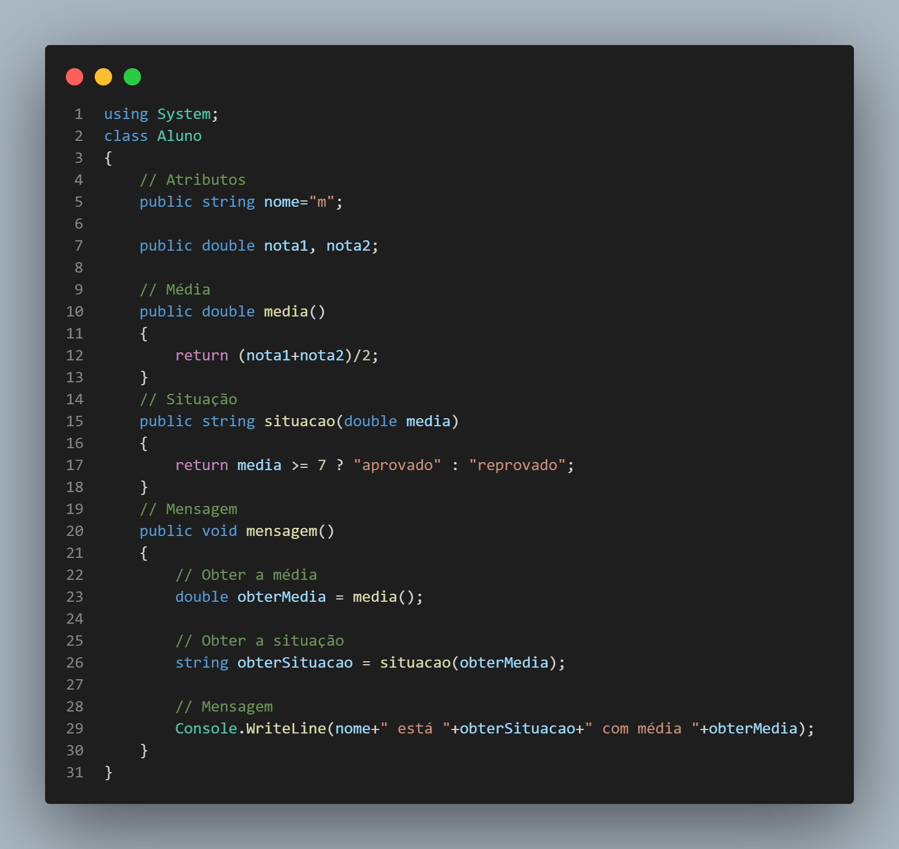
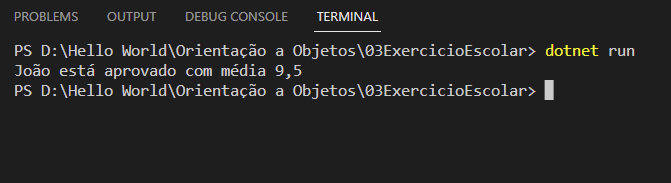
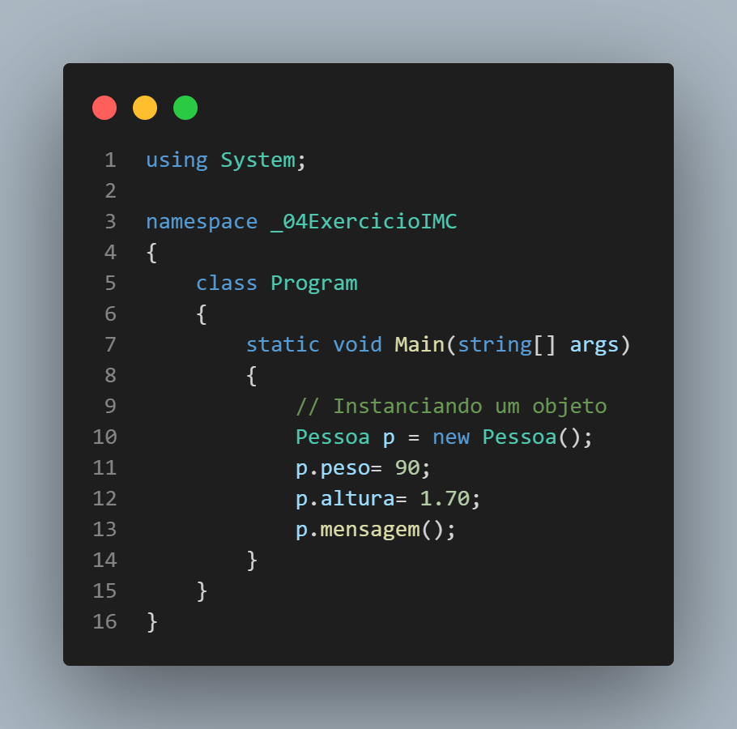
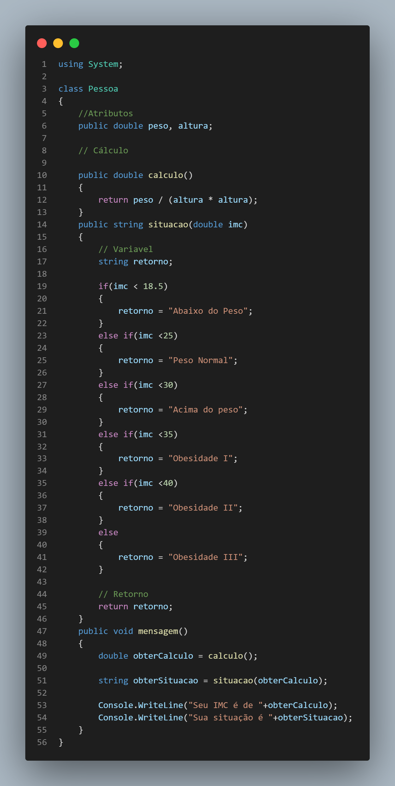
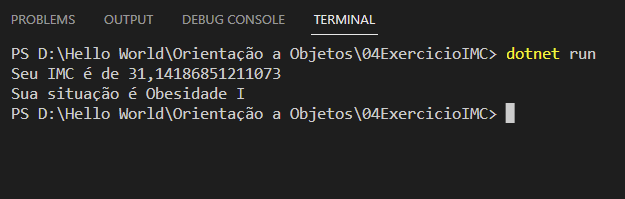

# Estudo de Orientação a Objetos com C#
> Estudo de Orientação a Objetos e resolução de exercicios.
---
### Exercicio Media Aluno
>Exercicio para obter a média de um aluno utilizando duas classes para execução e funcionamento do código.

#### Class Program

#### Class Aluno

### Output

---

### Exercicio IMC
> Exercicio para obter o imc de uma pessoa utilizando duas classes para execução e funcionamento do código.

#### Class Program

#### Class Pessoa

#### Output

---
#### Creditos:
* Aulas Realizadas pelo Canal [Ralf Lima](https://www.youtube.com/c/RalfLima).
* Playlist: [Orientação a Objetos com C#](https://www.youtube.com/playlist?list=PLWXw8Gu52TRKlAqSfkdhSTPtAfAcYko5E).

---
## Contato 

Gustavo Moreno - [Linkedin](https://www.linkedin.com/in/gustavo-moreno-5803a0229)

Meu e-mail: gustavomorenosiqueira86@gmail.com

Celular: (11) 99786-8798
